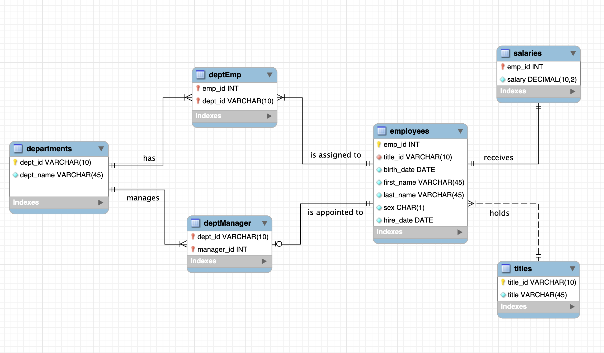
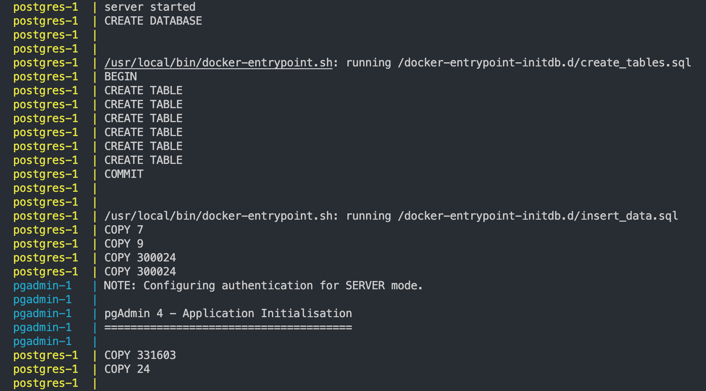
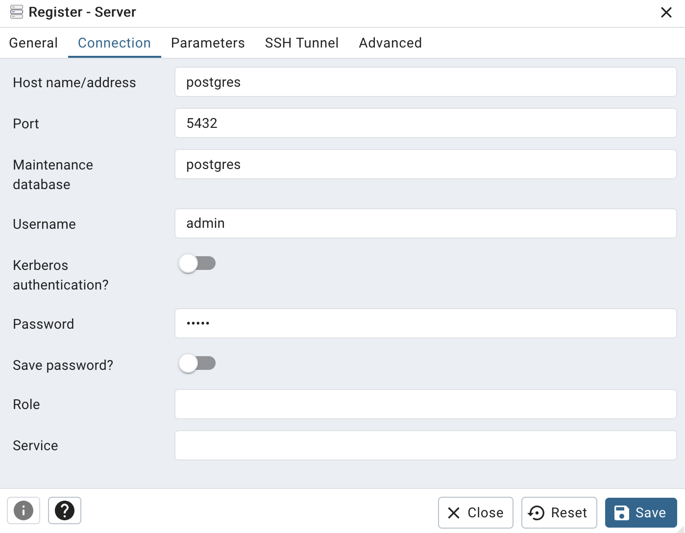
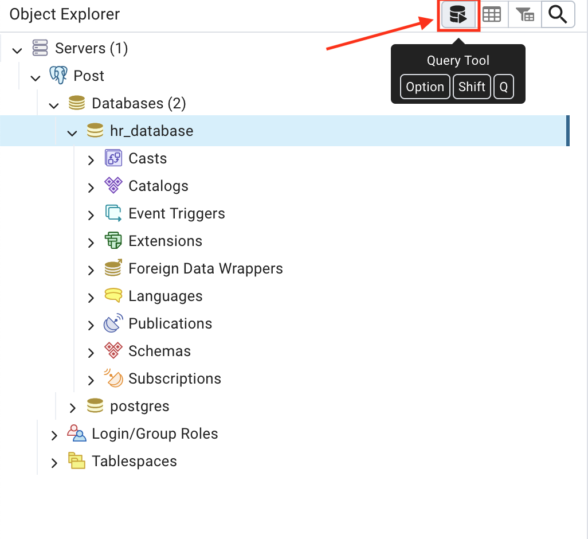

# Overview
Welcome! The objective of this task is to design a table schema based on the given CSV files, load the CSVs into a SQL database (PostgreSQL), and perform some data analysis to answer specific questions.
    
### The task is broken down into 5 steps:
1. **Review CSV files**: Use Python's Pandas package to inspect the data (`data_profiling.ipynb`).
2. **Draft the ERD**: Create an Entity-Relationship Diagram to model the database structure (`figures/ERD.png`).
3. **Create tables in the database**: Execute SQL scripts to create the tables in the correct order (`init/create_tables.sql`).
4. **Load data**: Import the CSV data into the corresponding tables (`init/insert_data.sql`).
5. **Data analysis**: Run SQL queries to perform data analysis (`data_analysis.txt`).


# Instructions

### What you'll need
- **Docker Desktop**: Ensure Docker Desktop is installed on your machine if you are using MacOS/Windows. If not, download it from [here](https://www.docker.com/products/docker-desktop).

### Let's get started

1. **Clone this repo**
```sh
    git clone https://github.com/kyphongmai/de-task.git
    cd de-task
```
2. **(Optional) Review the data and ERD**
- You can review the Jupyter Notebook (`data_profiling.ipynb`) to see how I inspect the data 
- Below is the ERD for this project
    

3. **Start Docker containers**: Run the following command to start the PostgreSQL server and initialise the database:

``` sh
    docker-compose up --build
```

- This launches two containers: one for PostgreSQL and another for PgAdmin4
- Initialisation phase: the scripts in the init folder will be executed in alphabetical order (`create_tables.sql` >> `insert_data.sql`)

    

4. **Access PgAdmin4**: Open your browser and go to 'http://localhost:8080'. Log in with the email and password specified in `docker-compose.yml`:
- email: admin@admin.com
- password: admin

5. **Connect to Postgres server**: Inside PgAdmin, set up a new server connection using the following:
- Name: Postgres Server
- Connection settings:
    + Host: postgres
    + Port: 5432
    + Username: admin
    + Password: admin

    
7. **Run SQL queries for analysis**
- Open the query tool for 'hr_database' 

    

- Copy and paste the SQL queries from 'data_analysis.txt', and 'Execute'

8. **Shutdown the environment**
After completing the task, shut down and remove the Docker containers and volumes using:

```sh
docker-compose down -v 
```

---
Thank you for checking out the project!
